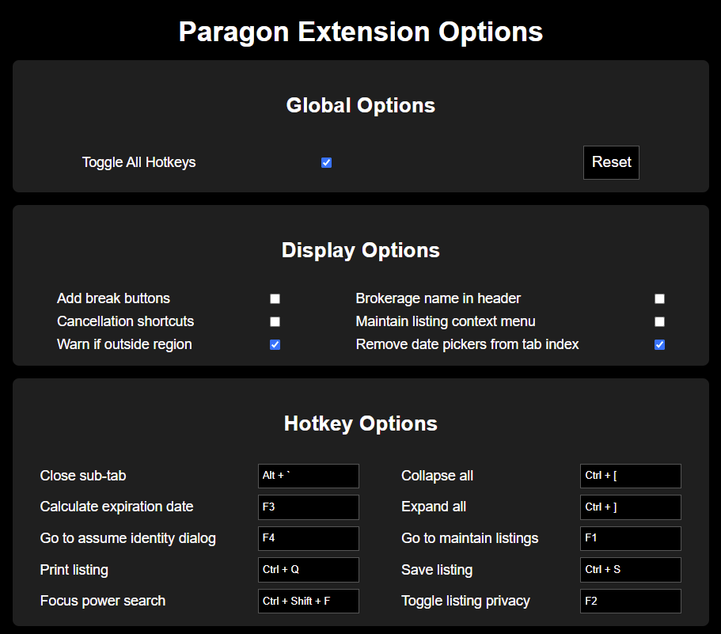

# Paragon Admin Extension

A Chrome extension improve Paragon productivity for board admins.

## Installing unpacked

Chrome by default only allows extensions from the official Chrome Web Store for security reasons. To test this extension locally, you will need to enable Developer Mode and load it unpacked. See this link for instructions.

## Customizing settings

Once the extension is loaded, an icon will appear in the extension tray at the top right of the browser. Clicking on this icon will open the extension's settings page. After changing any settings, make sure you reload any open Paragon tabs, as the changes will not take effect until then.

</img>
